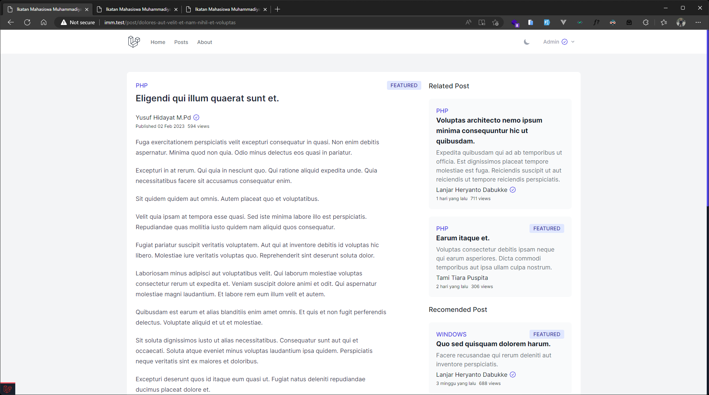
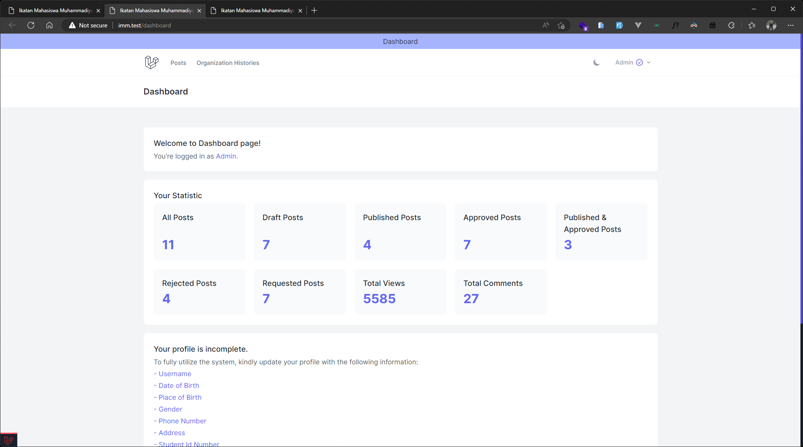

# Sistem Informasi Ikatan Mahasiswa Muhammadiyah
Sistem Informasi Ikatan Mahasiswa Muhammadiyah adalah aplikasi web yang digunakan untuk mengelola data-data IMM, mulai dari user, pimpinan, post, aktivitas, perkaderan, organisasi, riwayat organisasi, dokumen dan masih banyak lagi. Aplikasi ini dapat membantu mempermudah pengelolaan data IMM dan memastikan data yang tersimpan akurat dan teratur. 

Proyek ini bermula dari pikiran saya "someone needs to do it, right? why not just start?" dan saya memutuskan untuk membuat proyek ini. Saya berharap proyek ini dapat membantu IMM dalam mengelola data IMM.

## Kontribusi
Saya pribadi mengundang semua kader IMM untuk berkontribusi dalam proyek ini. Anda dapat membuat pull request ke repository ini. Kami sangat menyambut kontribusi dari semua pengembang.

Kode ini dibuat dengan bahasa inggris, jadi jika Anda ingin berkontribusi, silakan gunakan bahasa inggris untuk kode Anda. Penerjemahan bahasa Indonesia untuk UI akan dilakukan seiring berjalan.

## Screenshots

## Fitur
- [x] Login
- [x] Register
- [x] Forget Password
- [x] Verify Email
- [x] Dark Mode, Light Mode, System Preference Mode
- [ ] Public
  - [ ] Home
    - [ ] Welcome
    - [x] Featured Post
    - [ ] Latest Activities
    - [ ] Feature List
  - [ ] Posts
    - [x] Search
    - [x] List
    - [x] Category
    - [x] Single Post
      - [x] Comment
      - [x] Related Post
      - [x] Recommended Post
  - [ ] Activities
    - [ ] List, Category
    - [ ] Single Activity
      - [ ] Related Activity
  - [ ] Leaderships
  - [ ] Albums
  - [ ] Dokuments
    - [ ] List
    - [ ] Download
  - [ ] About
  - [x] Userpage
    - [x] User Profile (Public Information Only)
    - [ ] User Organization History (Approved Organization History Only)
    - [ ] User Perkaderan History (Approved Perkaderan History Only)
    - [ ] User Post by User (Approved Post Only)
- [ ] Dashboard - Auth
  - [ ] Profile - Auth & Verified Email
    - [ ] Edit
    - [ ] Update Password
    - [ ] Delete Account
  - [ ] Post - Auth, Verified Email, Verified Account (Need Admin to Approve)
    - [x] Search
    - [x] List
    - [ ] Create
    - [ ] Edit
    - [ ] Delete
    - [ ] Request Approval
  - [ ] Organization History - Auth & Verified Email (Need Admin to Approve)
    - [x] List
    - [x] Create
    - [x] Edit
    - [x] Delete 
    - [ ] Request Approval
  - [ ] Perkaderan History - Auth & Verified Email (Need Admin to Approve)
    - [ ] List
    - [ ] Create
    - [ ] Edit
    - [ ] Delete
    - [ ] Request Approval
- [ ] Admin
  - [ ] Users
    - [x] Search
    - [ ] Edit
    - [x] Verify
    - [x] View
    - [x] Reset Password
    - [x] Delete
  - [ ] All User Posts
    - [ ] Create
    - [ ] List
    - [ ] View
    - [ ] Edit
    - [ ] Delete
    - [ ] Approve
  - [ ] Post Categories
    - [ ] Create
    - [ ] List
    - [ ] Edit
    - [ ] Delete
  - [ ] Organizations
    - [ ] Create
    - [ ] List
    - [ ] Edit
    - [ ] Delete
  - [ ] Organization Fields
    - [ ] Create
    - [ ] List
    - [ ] Edit
    - [ ] Delete
  - [ ] Organization Positions
    - [ ] Create    
    - [ ] List
    - [ ] Edit
    - [ ] Delete
  - [ ] User Organization Histories
    - [ ] Create
    - [x] List
    - [x] Edit
    - [x] Delete
    - [ ] Approve
  - [ ] User Perkaderan Histories
    - [ ] Create
    - [ ] List
    - [ ] Edit
    - [ ] Delete
    - [ ] Approve
  - [ ] Perkaderan Fields
    - [ ] Create    
    - [ ] List
    - [ ] Edit
    - [ ] Delete
  - [ ] System Settings    
    - [ ] List
    - [ ] Edit
  - [ ] Activities
    - [ ] Create    
    - [ ] List
    - [ ] Edit
    - [ ] Delete
  - [ ] Activity Categories
    - [ ] Create  
    - [ ] List
    - [ ] Edit
    - [ ] Delete
  - [ ] Leaderships
    - [ ] Create    
    - [ ] List
    - [ ] Edit
    - [ ] Delete
  - [ ] Documents
    - [ ] Create    
    - [ ] List
    - [ ] Edit
    - [ ] Delete
  - [ ] Albums
    - [ ] Create    
    - [ ] List
    - [ ] Edit
    - [ ] Delete
 
## Teknologi yang Digunakan
- Laravel 9.x
- MySQL 5.x

## Database Relations
Akan dipublikasikan segera atau bisa dilihat di file migration.

## Package Tambahan
- Laravel Debugbar
- Laravel Breeze Blade
- Tailwind CSS

## Kredit
Proyek ini dibuat oleh Arif Budiman Arrosyid. Jika Anda memiliki pertanyaan atau saran, silakan buka issue pada repository ini atau kontak saya melalui [Telegram](https://t.me/arifbudimanarrosyid).
